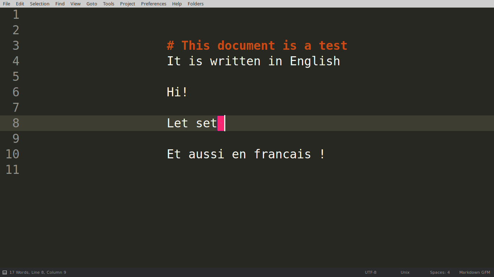

# [SublimeText3 SwitchDictionary](https://github.com/Naereen/SublimeText3_SwitchDictionary/) - BETA STAGE
## WARNING
[This plug-in](https://github.com/Naereen/SublimeText3_SwitchDictionary/) [is still in active development](https://github.com/Naereen/SublimeText3_SwitchDictionary/graphs/commit-activity) and in very early stage!

## About
It is a tiny [Sublime Text 3](https://www.sublimetext.com/3) plug-in (not tested on [ST 2](https://www.sublimetext.com/)), that add commands and shortcuts to switch between: no spell-check, spell-check for *French*, and spell-check for *English*.

*Note:* I hope it will soon be better, allowing you to define your own list of dictionaries.

## Demo (gif screencast)


----

## Commands
### `enable_english_spellcheck`
  - It enables spell-check, and sets the dictionary to *English*
  - [It is binded](Default.sublime-keymap) to the key chain <kbd>ctrl+k, ctrl+e</kbd>

### `enable_french_spellcheck`
  - It enables spell-check, and sets the dictionary to *French*
  - [It is binded](Default.sublime-keymap) to the key chain <kbd>ctrl+k, ctrl+f</kbd>

### `switch_spellcheck`
  - It cycles between *English*, *French*, and *None*
  - [It is binded](Default.sublime-keymap) to the key chain <kbd>ctrl+k, ctrl+s</kbd> and also to <kbd>ctrl+alt+s</kbd> (*s* for *switch*)

### `auto_switch_spellcheck`
  - It uses [langdetect.detect](https://github.com/Mimino666/langdetect) to (try to) automatically detect the language of the current file
  - Right now, the detected language is only used to know if it is French / or not French (English or other language). TODO I need to generalize this
  - It sets to *French* if the file is in French (or as a high probability of being written in French), and sets to *English* otherwise
  - [It is binded](Default.sublime-keymap) to <kbd>ctrl+alt+a</kbd> (*a* for *auto*)

### `disable_spellcheck`
  - It simply disables the spell-check
  - It is NOT binded to any key (*tip:* use the default command, binded to <kbd>F6</kbd>)

----

## Accessing commands through...
### :notebook: The *Command Palette* !
Press <kbd>ctrl+shift+p</kbd> (Windows, Linux) or <kbd>cmd+shift+p</kbd> (OS X) to open the [*Command Palette*](SwitchDictionary.sublime-commands), and then search for:

 - `Switch Dictionary: disable (None)`,
 - `Switch Dictionary: to English`,
 - `Switch Dictionary: to French`,
 - `Switch Dictionary: None ↔ French ↔ English`.
 - `Auto Switch Dictionary (guess)`.

### :mouse: The *Encoding Menu* !
In the status bar, you should have a menu showing the encoding of the current file (by default it is `UTF-8`).
Click on [the menu](Encoding.sublime-menu), and you can *click* on:

 - `Switch Dictionary – Disable (None)`
 - `Switch Dictionary – to English`
 - `Switch Dictionary – to French`
 - `Switch Dictionary – None ↔ French ↔ English`
 - `Auto Switch Dictionary (guess)`

### :musical_keyboard: *Shortcuts* !
[By default](Default.sublime-keymap), the following shortcuts are available

 - <kbd>ctrl+k, ctrl+e</kbd> : `Switch Dictionary – to English`
 - <kbd>ctrl+k, ctrl+f</kbd> : `Switch Dictionary – to French`
 - <kbd>ctrl+k, ctrl+s</kbd> or <kbd>ctrl+alt+s</kbd> : `Switch Dictionary – None ↔ French ↔ English`
 - <kbd>ctrl+alt+a</kbd> : `Auto Switch Dictionary (guess)`

----

## :question: How to install it ?
### :ok_hand: With [Package Control](https://packagecontrol.io/) : FIXME *NOT YET !*
If you have [Package Control](https://packagecontrol.io/) installed in Sublime Text 2/3, just press <kbd>ctrl+shift+p</kbd> (Windows, Linux) or <kbd>cmd+shift+p</kbd> (OS X) to open the *Command Palette*.

1. Start typing `install` to select `Package Control: Install Package`,
2. Then search for `SwitchDictionary` and select it. That's it!

### :floppy_disk: Manually, with [git](https://git-scm.com/)
You can also install this package manually by entering the Packages directory of Sublime Text 3 (through the menu: "Preferences" > "Browse packages"), and issuing this command on a terminal:

```bash
cd ~/.config/sublime-text-3/Packages/  # adapt the path on Windows or Mac OS X
git clone https://github.com/Naereen/SublimeText3_SwitchDictionary
```

### Check it
You can check it was well installed by hitting <kbd>ctrl+k, ctrl+s</kbd> (it should enable English spell checking).

----

## :boom: [TODO !](https://github.com/Naereen/SublimeText3_SwitchDictionary/projects/1)
- [X] Test it on another laptop : DONE on another Linux laptop
- [ ] Test it on Mac OS X and/or Windows ??
- [X] Implement a smart detection, to know if a file is in French or in English
- [ ] Be more general, allow a user to define his own favorite dictionaries
- [ ] Finish it
- [ ] Publish it on [Package Control](https://packagecontrol.io/) !

## :hourglass: [Future Features](https://github.com/Naereen/SublimeText3_SwitchDictionary/projects/1)
- Be more general: allow users to define manually a list of dictionary (path, and name), and add one command for each dictionary, and make the switch_spellcheck command cycle between them! XXX Use the [ST2 SwitchLanguage plugin](https://packagecontrol.io/packages/SwitchLanguage) ?

----

### :scroll: License
This plug-in is published under the terms of the [MIT license](http://lbesson.mit-license.org/) (file [LICENSE.txt](LICENSE.txt)).
© [Lilian Besson](https://github.com/Naereen), 2016.

[](https://github.com/Naereen/ama)
[](https://github.com/Naereen/SublimeText3_SwitchDictionary/)
